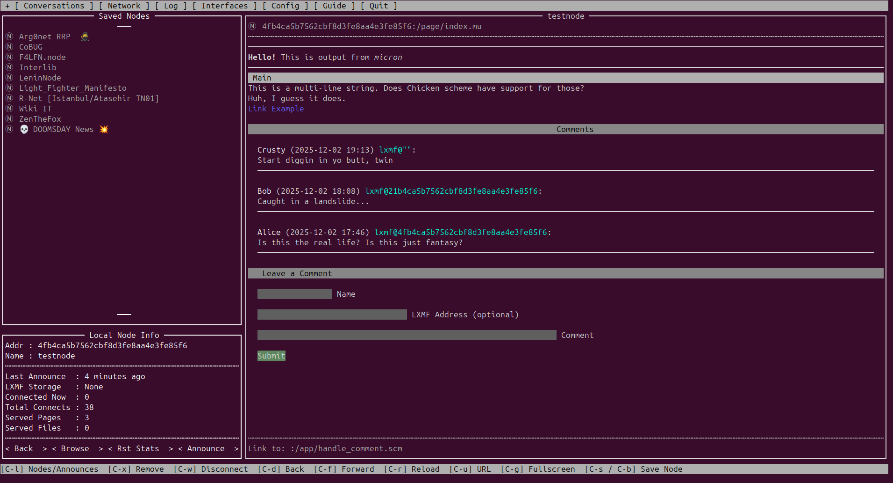

# README

This is a work in progress library for generating micron pages for [nomadnet](https://github.com/markqvist/NomadNet) in [chicken scheme](https://call-cc.org/).



## Project Layout

```bash
pages
|____micron-dsl.scm
|
|____index.mu
|
|____app
    |_____models.scm // SQLite functions go here
    |
    |_____actions
    |     |________handle_comments.mu // Each file does CRUD + other stuff
    |
    |_____templates
          |________comments.mu // template functions
```

## Run Locally

Install chicken scheme
```bash
sudo apt update
sudo apt-get install chicken-bin
sudo chicken-install srfi-1
sudo chicken-install srfi-13
sudo chicken-install srfi-19
```

Run the demo page manually:
```bash
cd ./framework/pages
csi -s ./index.mu 
```

Or just copy the contents of `/framework/pages` to `~/.nomadnetwork/storage/pages`

### Tips

[The Schematics of Computation by Manis and Little](https://www.math.purdue.edu/~lucier/schematics-front.pdf)

If using vscode, download the Scheme extension and make sure that .mu files are recognized as scheme:
`Preferences -> Settings -> type: "files.associations"` and add a mapping from `*.mu` to `scheme`.

Install a scheme language server. 
```bash
sudo chicken-install -s apropos chicken-doc srfi-18
cd `csi -R chicken.platform -p '(chicken-home)'`
curl http://3e8.org/pub/chicken-doc/chicken-doc-repo.tgz | sudo tar zx
sudo chicken-install lsp-server
```

Add a scheme lsp extension to vscode. Open the command palette and type `ext install rgherdt.scheme-lsp`

### TODO
- [ ] get a decent dev environment going
- [ ] switch from file-based comments, to sqlite-based comment system
    - [ ] create a simple sqlite database https://wiki.call-cc.org/eggref/5/sql-de-lite#preparing-a-sql-statement
    - [ ] implement comments
- [ ] update my personal node with this

- [ ] integrate recipe search
    - [ ] run hari.recipes locally
    - [ ] query the API and html
    - [ ] parse and list
    - [ ] click on list entry and load HTML
    - [ ] convert HTML to micron
- [ ] create epub search

- [ ] compile the custom modules
- [ ] add instructions for users to build and use the custom modules
- [ ] add some tutorials

https://wiki.call-cc.org/chicken-for-python-programmers